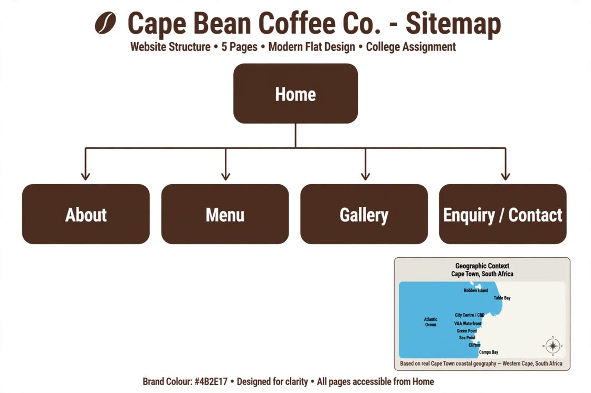
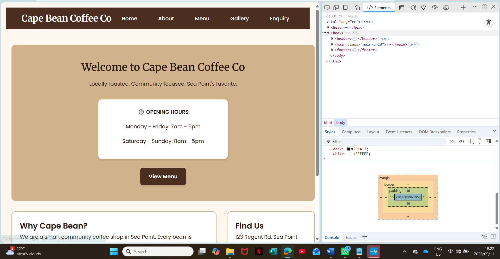

# Cape Bean Coffee Co. - WEDE5020 Part 2
**Student:** Anentlahlah Duku - ST10507071  
**Module:** WEDE5020 - Web Development  
**GitHub:** https://github.com/AnentlahlahDuku/WEDE5020-Part1-ST10507071

## Project Description
Cape Coffee Bean is a local artisan coffee shop based in Cape Town. The website showcases specialty coffee blends, fresh pastries, and cozy cafe atmosphere. It aims to connect coffee lovers with our story, menu, and location.

## Website Goals and Objectives
- To create an online presence for Cape Coffee Bean to attract new customers
- To display the menu, opening hours, and location of the shop
- To allow customers to send enquiries
- To share the brand story and commitment to locally sourced beans

## Part 1 Feedback - Corrections Implemented
**Feedback:** No HTML implementation evidenced, linear sitemap not visual, no changelog or descriptive commits.

**Fixes:**
1. Implemented 5 semantic HTML5 pages: index.html, about.html, menu.html, gallery.html, enquiry.html
2. Replaced linear sitemap with visual hierarchical sitemap with brand colour #4B2E17
3. Added descriptive commits and changelog below

## Sitemap
### Visual Sitemap

- Home - Welcome, hero image, featured products
- About - Story of Cape Coffee Bean and our values
- Menu - Coffee menu and pastries
- Gallery - Cafe atmosphere images
- Enquiry - Form for custom orders and questions

## Technologies Used - Part 2 Update
- HTML5 semantic tags
- CSS3 external stylesheet: css/style.css
- Layout: Flexbox for nav, CSS Grid for menu
- Brand Colours: #4B2E17, #FFF8E1, #C8A27E
- Fonts: Poppins, Open Sans (Google Fonts)
- Responsive: Media queries @768px and @480px, rem/%, srcset
- Chrome DevTools for testing

## Responsive Design - Evidence (Section 3.4)
Tested on 3 devices:

### Desktop View - 1920px

### Tablet View - 768px

### Mobile View - iPhone XR 414px

## Changelog
- 2026-08-01: Part 1 - Initial proposal and text sitemap
- 2026-09-05: Fixed Part 1 - Added 5 HTML pages with semantic tags and consistent nav
- 2026-09-09: Part 2 - Created css/style.css with Flexbox, Grid, brand colour #4B2E17
- 2026-09-10: Part 2 - Implemented responsive design, media queries, relative units
- 2026-09-11: Added visual sitemap, responsive screenshots to images folder and README

## References - Harvard Style
- Mozilla Developer Network (MDN). 2024. HTML: HyperText Markup Language. Available at: https://developer.mozilla.org/en-US/docs/Web/HTML [Accessed 10 September 2026].
- Mozilla Developer Network (MDN). 2024. CSS: Cascading Style Sheets. Available at: https://developer.mozilla.org/en-US/docs/Web/CSS [Accessed 10 September 2026].
- W3Schools. 2024. CSS Flexbox. Available at: https://www.w3schools.com/css/css3_flexbox.asp [Accessed 9 September 2026].
- Google Fonts. 2024. Poppins & Open Sans. Available at: https://fonts.google.com/ [Accessed 8 September 2026].
- Pexels. 2024. Free Coffee Shop Stock Photos. Available at: https://www.pexels.com/ [Accessed 7 September 2026].
